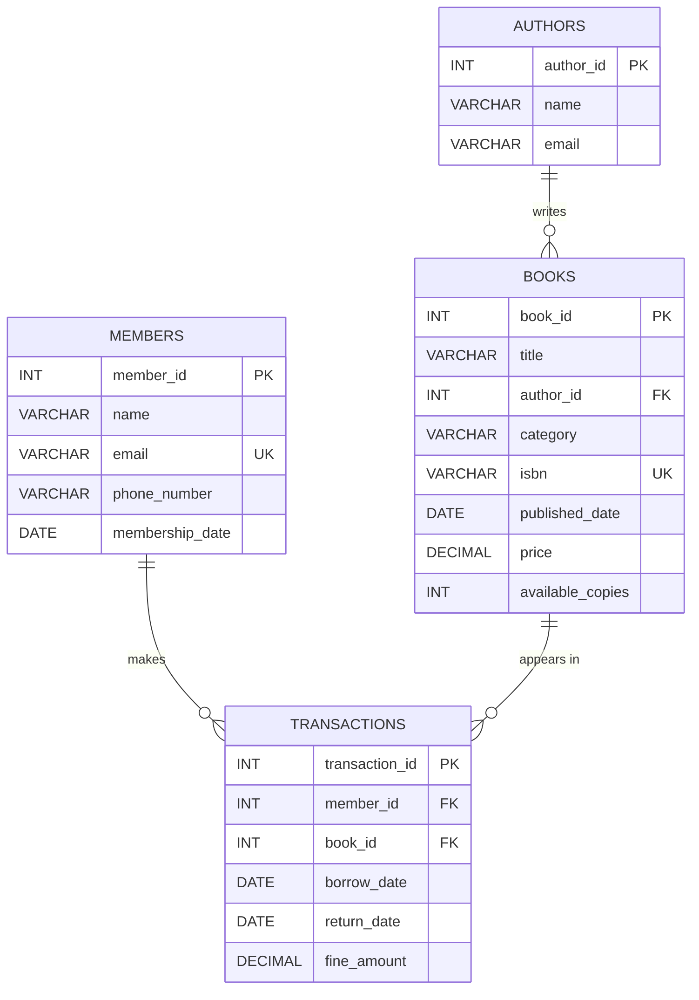
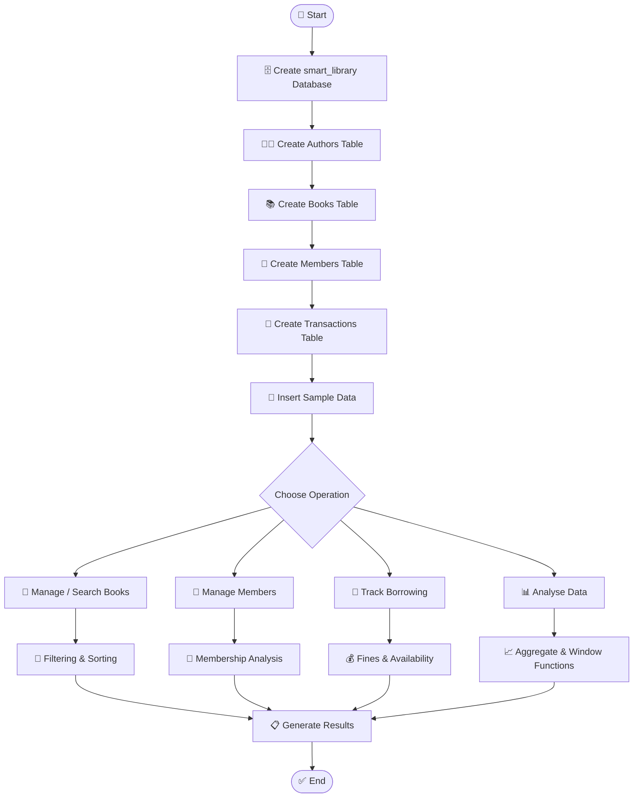

# 📚 Smart Library Management System

A **MySQL-based Smart Library Management System** designed to manage books, authors, members, and borrowing transactions. The project demonstrates practical SQL concepts including **DDL, DML, filtering, sorting, grouping, aggregate functions, joins, subqueries, date functions, string functions, window functions, and CASE expressions**.

> 🛠️ **Database:** MySQL  
> 🗄️ **Database Name:** `smart_library`  
> 📌 **Main Tables:** Authors, Books, Members, Transactions

---

## 📑 Table of Contents

- [🌟 Project Overview](#-project-overview)
- [🎯 Objectives](#-objectives)
- [🛠️ Technologies Used](#️-technologies-used)
- [🗂️ Database Schema](#️-database-schema)
  - [Authors Table](#1-authors-table)
  - [Books Table](#2-books-table)
  - [Members Table](#3-members-table)
  - [Transactions Table](#4-transactions-table)
- [🔗 Table Relationships](#-table-relationships)
- [🔄 Project Flow Chart](#-project-flow-chart)
- [📊 Database Operations & SQL Concepts](#-database-operations--sql-concepts)
- [📸 Project Showcase](#-project-showcase)
- [📈 Sample Results](#-sample-results)
- [▶️ How to Run](#️-how-to-run)
- [💡 Key Features](#-key-features)
- [📌 Conclusion](#-conclusion)

---

## 🌟 Project Overview

The **Smart Library Management System** stores and manages information about library books, their authors, registered members, and book borrowing transactions.

The SQL project creates the `smart_library` database and four related tables. It also contains sample records and demonstrates different SQL queries for retrieving, updating, analysing, and presenting library data.

The project includes examples of:

- 📕 Book and author management
- 👤 Member management
- 🔄 Borrowing transaction management
- 💰 Fine calculation/reporting
- 🔎 Data filtering and searching
- 📊 Data aggregation and analysis
- 🔗 SQL joins
- 🧩 Subqueries
- 📅 Date and string functions
- 🏆 Window functions
- 🏷️ Conditional classification using `CASE`

---

## 🎯 Objectives

1. Create a structured relational database for library management.
2. Store author, book, member, and transaction information.
3. Manage book availability.
4. Track borrowing and returning activity.
5. Retrieve useful information using SQL queries.
6. Analyse library data using aggregate and window functions.
7. Demonstrate different types of SQL joins and subqueries.
8. Generate meaningful reports from the database.

---

## 🛠️ Technologies Used

| Technology | Purpose |
|---|---|
| 🐬 **MySQL** | Database management system |
| 💻 **MySQL Monitor / CLI** | Executing SQL commands |
| 📝 **SQL** | Database creation, manipulation and analysis |
| 📊 **Relational Database** | Storing connected library data |

The screenshots show execution using **MySQL Community Server 8.0.46**.

---

# 🗂️ Database Schema

The database is named **`smart_library`** and contains four main tables.

### 1. Authors Table

| Column | Data Type | Key / Constraint | Description |
|---|---|---|---|
| `author_id` | INT | Primary Key, Auto Increment | Unique author ID |
| `name` | VARCHAR(150) | NOT NULL | Author name |
| `email` | VARCHAR(150) | — | Author email |

### 2. Books Table

| Column | Data Type | Key / Constraint | Description |
|---|---|---|---|
| `book_id` | INT | Primary Key, Auto Increment | Unique book ID |
| `title` | VARCHAR(255) | NOT NULL | Book title |
| `author_id` | INT | Foreign Key | References `Authors.author_id` |
| `category` | VARCHAR(100) | — | Book category |
| `isbn` | VARCHAR(20) | UNIQUE | ISBN number |
| `published_date` | DATE | — | Publication date |
| `price` | DECIMAL(10,2) | — | Book price |
| `available_copies` | INT | DEFAULT 1 | Available copies |

### 3. Members Table

| Column | Data Type | Key / Constraint | Description |
|---|---|---|---|
| `member_id` | INT | Primary Key, Auto Increment | Unique member ID |
| `name` | VARCHAR(150) | NOT NULL | Member name |
| `email` | VARCHAR(150) | UNIQUE | Member email |
| `phone_number` | VARCHAR(20) | — | Member phone number |
| `membership_date` | DATE | DEFAULT CURRENT_DATE | Membership date |

### 4. Transactions Table

| Column | Data Type | Key / Constraint | Description |
|---|---|---|---|
| `transaction_id` | INT | Primary Key, Auto Increment | Unique transaction ID |
| `member_id` | INT | Foreign Key | References `Members.member_id` |
| `book_id` | INT | Foreign Key | References `Books.book_id` |
| `borrow_date` | DATE | DEFAULT CURRENT_DATE | Date book was borrowed |
| `return_date` | DATE | NULL allowed | Date book was returned |
| `fine_amount` | DECIMAL(10,2) | DEFAULT 0.00 | Fine amount |

---

## 🔗 Table Relationships



### Relationship Explanation

- 👨‍💻 **Authors → Books:** One author can be associated with multiple books.
- 👤 **Members → Transactions:** One member can have multiple borrowing transactions.
- 📚 **Books → Transactions:** One book can appear in multiple borrowing transactions.
- 🔑 Foreign keys maintain relationships between the tables.
- 🛡️ `ON DELETE SET NULL` is used for the `Books.author_id` relationship.
- 🛡️ `ON DELETE CASCADE` is used for member and book references in `Transactions`.

---

# 🔄 Project Flow Chart



---

# 📊 Database Operations & SQL Concepts

The SQL file demonstrates the following concepts:

| Concept | Example / Purpose |
|---|---|
| 🏗️ DDL | `CREATE DATABASE`, `CREATE TABLE` |
| ✏️ DML | `INSERT`, `UPDATE`, `DELETE` |
| 🔍 Filtering | `WHERE`, `AND`, `OR`, `NOT` |
| ↕️ Sorting | `ORDER BY` |
| 📦 Grouping | `GROUP BY` |
| 🧮 Aggregate Functions | `COUNT()`, `AVG()`, `SUM()` |
| 🔗 Joins | `INNER JOIN`, `LEFT JOIN`, `RIGHT JOIN` |
| 🧩 Subqueries | Nested `SELECT` statements |
| 📅 Date Functions | `YEAR()`, `DATEDIFF()`, `DATE_FORMAT()` |
| 🔤 String Functions | `UPPER()`, `TRIM()`, `COALESCE()` |
| 🏆 Window Functions | `DENSE_RANK()`, running totals, moving average |
| 🏷️ Conditional Logic | `CASE` expressions |

---

## 🔎 Example Queries

### 📚 Find Available Books

```sql
SELECT * 
FROM Books 
WHERE available_copies > 0;
```

### 💰 Find Average Book Price

```sql
SELECT AVG(price) AS average_book_price 
FROM Books;
```

### 📊 Count Books by Category

```sql
SELECT category, COUNT(*) AS total_books
FROM Books
GROUP BY category;
```

### 🔗 Display Books with Author Names

```sql
SELECT b.title, a.name AS author_name
FROM Books b
INNER JOIN Authors a 
ON b.author_id = a.author_id;
```

### 🏆 Rank Books by Borrowing Count

```sql
SELECT book_id,
       COUNT(*) AS times_borrowed,
       DENSE_RANK() OVER (ORDER BY COUNT(*) DESC) AS book_rank
FROM Transactions
GROUP BY book_id;
```

---

# 📸 Screenshots

The following screenshots are included in the `assets/` folder so that they display correctly when this README is uploaded to GitHub.

## 🖥️ 1. Database Import & Execution


## 📚 2. Book Data & Query Results


## 📊 3. Book Analysis Results


## 📈 4. Aggregate & Join Results


## 🏆 5. Date, String & Advanced SQL Results


# 📈 Sample Results

Based on the executed SQL screenshots, the project produced results such as:

### 📚 Books

| Book | Category | Price | Available Copies |
|---|---|---:|---:|
| A Brief History of Time | Science | ₹450.00 | 3 |
| Clean Code | Technology | ₹650.00 | 2 |
| Harry Potter | Fiction | ₹350.00 | 0 |

### 📊 Category-wise Book Count

| Category | Total Books |
|---|---:|
| Science | 1 |
| Technology | 1 |
| Fiction | 1 |

### 💰 Average Book Price

**483.333333**

### 👨‍💻 Books with Authors

| Book | Author |
|---|---|
| A Brief History of Time | Stephen Hawking |
| Clean Code | Robert C. Martin |
| Harry Potter | J.K. Rowling |

---

# ▶️ How to Run

### 1️⃣ Install MySQL

Install MySQL Community Server and open **MySQL Monitor**.

### 2️⃣ Open MySQL

```bash
mysql -u root -p
```

### 3️⃣ Run the SQL file

```sql
SOURCE C:/Users/YourName/Downloads/library_management.sql;
```

### 4️⃣ Select the database

```sql
USE smart_library;
```

### 5️⃣ Check the tables

```sql
SHOW TABLES;
```

### 6️⃣ View the data

```sql
SELECT * FROM Authors;
SELECT * FROM Books;
SELECT * FROM Members;
SELECT * FROM Transactions;
```

---

# 💡 Key Features

- 📚 Complete library database structure
- 👨‍💻 Author information management
- 📖 Book information management
- 👤 Member management
- 🔄 Borrowing transaction tracking
- 📦 Book availability tracking
- 💰 Fine amount storage
- 🔍 Advanced searching and filtering
- 🔗 Multiple SQL join examples
- 🧩 Subquery examples
- 📊 Aggregate analysis
- 🏆 Ranking with window functions
- 📅 Date-based analysis
- 🔤 String manipulation
- 🏷️ Conditional classification

---

# 📌 Conclusion

The **Smart Library Management System** demonstrates how a relational database can be designed and queried to manage common library activities. The project provides practical experience with database design, primary keys, foreign keys, data manipulation, joins, subqueries, aggregate functions, date/string functions, window functions, and conditional SQL logic.

This project can be further extended with a **web or desktop application interface**, login/authentication, automated fine calculation, dashboards, and real-time book availability.

---

## 👩‍💻 Project Status

**Status:** ✅ Completed SQL Database Project

**Database:** `smart_library`

**Main Tables:** `Authors` • `Books` • `Members` • `Transactions`

---

